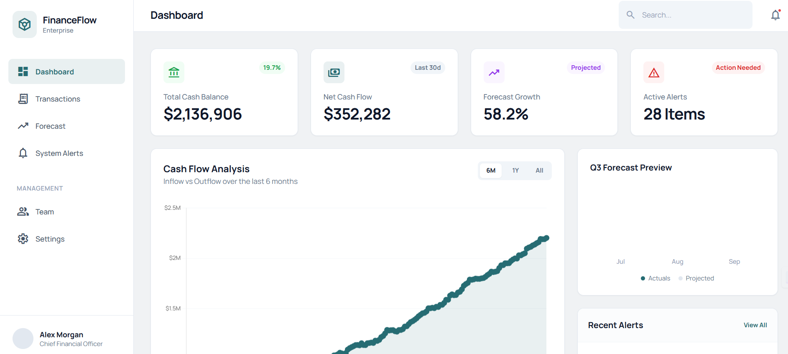
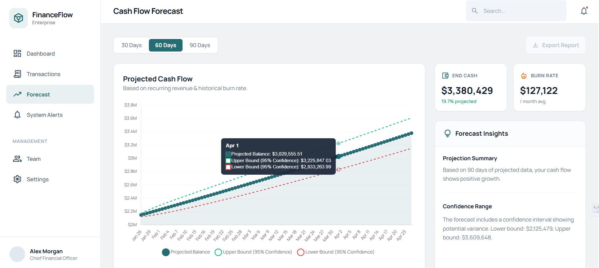
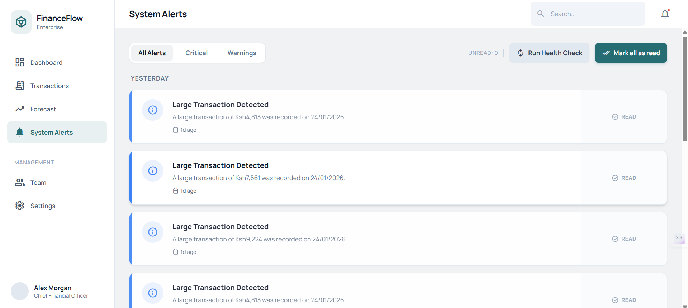
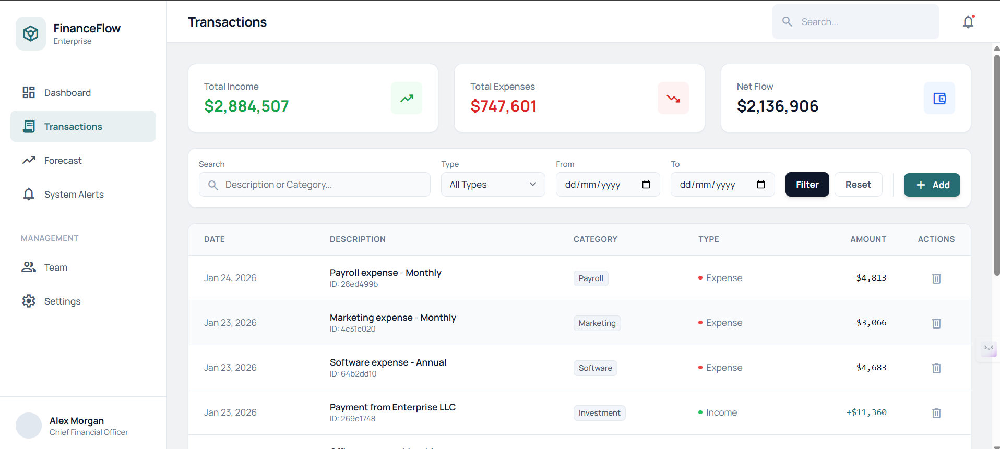
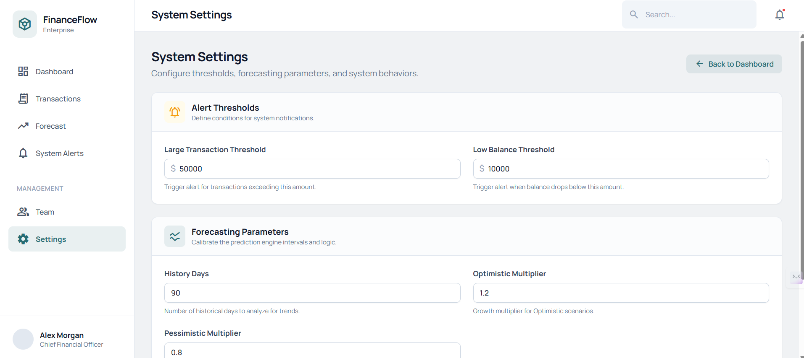

# CashFlowDashboard - Hackathon Submission Presentation

**DVHacks 2026 Submission**

> **Predictive Financial Intelligence for Small Business.**  
> *Because 82% of small businesses fail due to cash flow problems, not profit.*

---

## 1. Problem Statement

Small business owners face a critical challenge: **they know what's in the bank today, but have zero visibility into next month.**

### The Pain Points

*   **Cash Flow Stress**: Seasonal swings and late payments make cash flow the #1 stress point, jeopardizing business survival [1].
*   **Financial Uncertainty**: Businesses don't know when shortfalls will hit until it's too late, leading to poor planning decisions [2].
*   **Expensive Solutions**: Enterprise ERP systems cost thousands per month, while spreadsheets are too static and error-prone.
*   **Result**: Usable cash runs out unexpectedly, leading to business failure.

### The Statistics

*   82% of small businesses fail due to cash flow problems, not lack of profit [1]
*   Cash flow management is the top stress point for small business owners [1]
*   Financial uncertainty prevents effective planning and growth [2]

---

## 2. Our Solution

**CashFlowDashboard** democratizes **predictive financial intelligence** for small businesses. We use **algorithmic forecasting** (Linear Regression Analysis) to project cash positions 30-90 days ahead, giving owners the visibility they need to make informed decisions **before** it's too late.

### How It Works

1. **Data Collection**: Users enter income and expense transactions through an intuitive interface (future: automated bank feed integration).

2. **Pattern Analysis**: Our `ForecastService` analyzes historical cash flow trends using **Linear Regression** to calculate:
   - **Burn Rate**: Average monthly cash consumption
   - **Growth Slope**: Trend direction (positive/negative)
   - **Volatility**: Standard deviation for risk assessment

3. **Projection Engine**: Generates three scenario forecasts:
   - **Base Case**: Pure statistical trend projection
   - **Optimistic**: +20% growth multiplier
   - **Pessimistic**: -20% decline multiplier

4. **Smart Alerts**: Rule-based system monitors projected balances and triggers proactive warnings for:
   - Low balance thresholds
   - Unusual transaction patterns
   - Projected shortfalls

### Key Innovations

*   **No AI/ML Dependencies**: Pure statistical analysis using Linear Regression and Standard Deviation calculations - fully transparent and explainable (no "black box").
*   **Confidence Intervals**: Shows ±2σ (95% confidence) bounds so owners understand forecast uncertainty.
*   **Real-Time Analytics**: Pre-computed forecasts stored in database for instant dashboard loading.
*   **Production-Ready Architecture**: Clean MVC with Repository Pattern, Service Layer, and comprehensive error handling.

### Impact & Benefits

*   **Prevents Business Failure**: Early warning system helps owners take corrective action before cash runs out.
*   **Reduces Stress**: Clear visibility into future cash positions eliminates guesswork and anxiety.
*   **Affordable Alternative**: No expensive ERP systems required - runs on simple SQLite database, deployable anywhere.
*   **Actionable Insights**: Scenario planning helps owners prepare for best and worst-case outcomes.

---

## 3. Technical Details

### Technology Stack

*   **ASP.NET Core MVC 8** – Server-side rendering framework for rapid development and SEO-friendly pages.
*   **.NET 8 (LTS)** – Long-term support version ensuring stability and future compatibility.
*   **Entity Framework Core** – ORM with automated migrations and LINQ query support.
*   **SQLite** – Zero-configuration database (easily migratable to PostgreSQL for production).
*   **Chart.js** – Client-side charting library for interactive financial visualizations.
*   **Tailwind CSS** – Utility-first CSS framework for modern, responsive UI design.
*   **Serilog** – Structured logging for debugging and monitoring.

### Core Algorithms

**Linear Regression Forecasting** (`ForecastService.cs`):
```csharp
// Calculates slope (m) and intercept (b) from historical data
// Projected Balance = m * daysAhead + b
// Confidence Bounds = Projected ± (2 * Standard Deviation)
```

**Key Features**:
*   Analyzes historical net cash flow trends
*   Calculates daily burn rate slope
*   Projects future balances with 95% confidence intervals
*   Supports multiple scenario modeling

**Alert Rule Engine** (`AlertService.cs`):
*   **Low Balance Detection**: Compares projected minimum balance against configured thresholds.
*   **Anomaly Detection**: Flags transactions exceeding statistical norms.
*   **Trend Analysis**: Identifies accelerating burn rates.

### Architecture Highlights

**Layered Architecture**:
```
┌─────────────────────────────────────┐
│   Presentation Layer (Controllers)  │
├─────────────────────────────────────┤
│   Service Layer (Business Logic)    │
├─────────────────────────────────────┤
│   Repository Layer (Data Access)    │
├─────────────────────────────────────┤
│   Database (SQLite/PostgreSQL)      │
└─────────────────────────────────────┘
```

**Design Patterns**:
*   **Repository Pattern**: Abstracts data access for testability and future database migrations.
*   **Service Layer**: Encapsulates business logic (forecasting, analytics, alert generation).
*   **DTO Pattern**: Strict data contracts prevent over-posting attacks and maintain clean API boundaries.
*   **Global Exception Filter**: Maps service-layer exceptions to appropriate HTTP status codes.
*   **ViewModel Pattern**: Type-safe view models prevent null reference exceptions.

### Data Flow

1. **User Input** → `TransactionsController` → `TransactionService` → `TransactionRepository` → Database
2. **Forecast Request** → `ForecastController` → `ForecastService` (calculates projections) → `ForecastRepository` → Database
3. **Alert Generation** → Background process → `AlertService` (evaluates rules) → `AlertRepository` → Database
4. **Dashboard Display** → `HomeController` → Multiple Services → Aggregated `DashboardViewModel` → View

---

## 4. Features

### Dashboard
*   **Current Cash Position**: Real-time total cash available with trend indicators.
*   **Cash Flow Trends**: Interactive Chart.js visualizations showing historical patterns.
*   **Quick Metrics**: Net cash flow (30-day), growth rate, and active alert count.
*   **Recent Activity**: Latest transactions and alerts for immediate context.



### Forecasting Engine
*   **Multi-Horizon Projections**: 30, 60, and 90-day forecasts with one-click generation.
*   **Scenario Analysis**: Toggle between Base, Optimistic (+20%), and Pessimistic (-20%) scenarios.
*   **Confidence Intervals**: Visual upper/lower bounds showing forecast uncertainty (95% confidence).
*   **Burn Rate Calculation**: Automatic monthly consumption rate analysis.



### Smart Alert System
*   **Proactive Warnings**: Low balance alerts before cash runs out.
*   **Severity Levels**: Critical, Warning, and Info classifications.
*   **Filtering & Management**: Filter by severity, mark as read, pagination support.
*   **Time-Based Grouping**: Alerts organized by Today, Yesterday, and Older.



### Transaction Management
*   **CRUD Operations**: Create, read, update, and delete income/expense entries.
*   **Search & Filter**: Real-time search by description, category, date range, and type.
*   **Modal Interface**: Smooth, no-reload editing experience.
*   **Pagination**: Efficient handling of large transaction datasets.



### Settings & Configuration
*   **Runtime Configuration**: Adjust alert thresholds and forecast parameters without code changes.
*   **User Empowerment**: Business users can calibrate the system to their specific needs.
*   **Hot Reloading**: Changes take effect immediately without application restart.



---

## 5. Additional Information

### Development Approach

This project was built following **Clean Architecture** principles with a focus on:

*   **Separation of Concerns**: Clear boundaries between Presentation, Business Logic, and Data Access layers.
*   **Testability**: Service layer and repositories are fully unit-testable (test suite included in `CashFlowDashboard.Tests`).
*   **Maintainability**: Comprehensive documentation including 6 Architecture Decision Records (ADRs).
*   **Scalability**: Architecture supports future enhancements (bank integrations, multi-tenancy, advanced ML models).

### Code Quality

*   **Zero Build Warnings**: Clean compilation with strict null-checking enabled.
*   **Error Handling**: Global exception filter with graceful degradation.
*   **Logging**: Structured logging with Serilog for debugging and monitoring.
*   **Database Migrations**: Version-controlled schema changes via EF Core migrations.

### Documentation

*   **Backend Architecture Spec**: 850+ line technical specification document (`Docs/backend-architecture.md`).
*   **Architecture Decision Records**: 6 ADRs documenting key technical choices (`Docs/adr/`).
*   **Video Demo Script**: Step-by-step guide for 3-4 minute demonstration (`Docs/VIDEO_SCRIPT.md`).
*   **Inline Code Comments**: Strategic comments explaining business logic and algorithms.

### Future Roadmap

*   **Reports & Exports**: Generate PDF/CSV reports for income/expenses and projections.
*   **Bank Feeds**: Plaid integration for automated transaction syncing.
*   **Tax Vault**: Auto-calculate estimated quarterly tax payments.
*   **Multi-Tenancy**: SaaS support for Accountants managing multiple clients.
*   **Advanced Forecasting**: ARIMA models, exponential smoothing, ML-based predictions.

---

## 6. Getting Started

### Quick Start (60 seconds)

1.  **Clone & Enter**
    ```bash
    git clone https://github.com/owuorviny109/CashFlowDashboard.git
    cd CashFlowDashboard/CashFlowDashboard
    ```

2.  **Run the Application**
    *The database will be created and seeded automatically with 6 months of realistic transaction data on first run.*
    ```bash
    dotnet run
    ```

3.  **Launch**
    Open `http://localhost:5236` (or the port shown in the terminal).

### Requirements

*   .NET 8 SDK
*   No database setup required (SQLite auto-creates)

---

## 7. References

[1] "Cash Flow Management — a Top Stress Point". [QuickBooks](https://quickbooks.intuit.com/r/cash-flow/cash-flow-problems/)

[2] "Small Business Pain Points: Financial Uncertainty". [PainOnSocial](https://painonsocial.com/blog/small-business-pain-points)

---

## 8. License

Distributed under the MIT License. See [LICENSE](LICENSE) for more information.

---

**Built with .NET for DVHacks 2026** 

For detailed technical documentation, see [README.md](README.md) and [Backend Architecture](Docs/backend-architecture.md).

